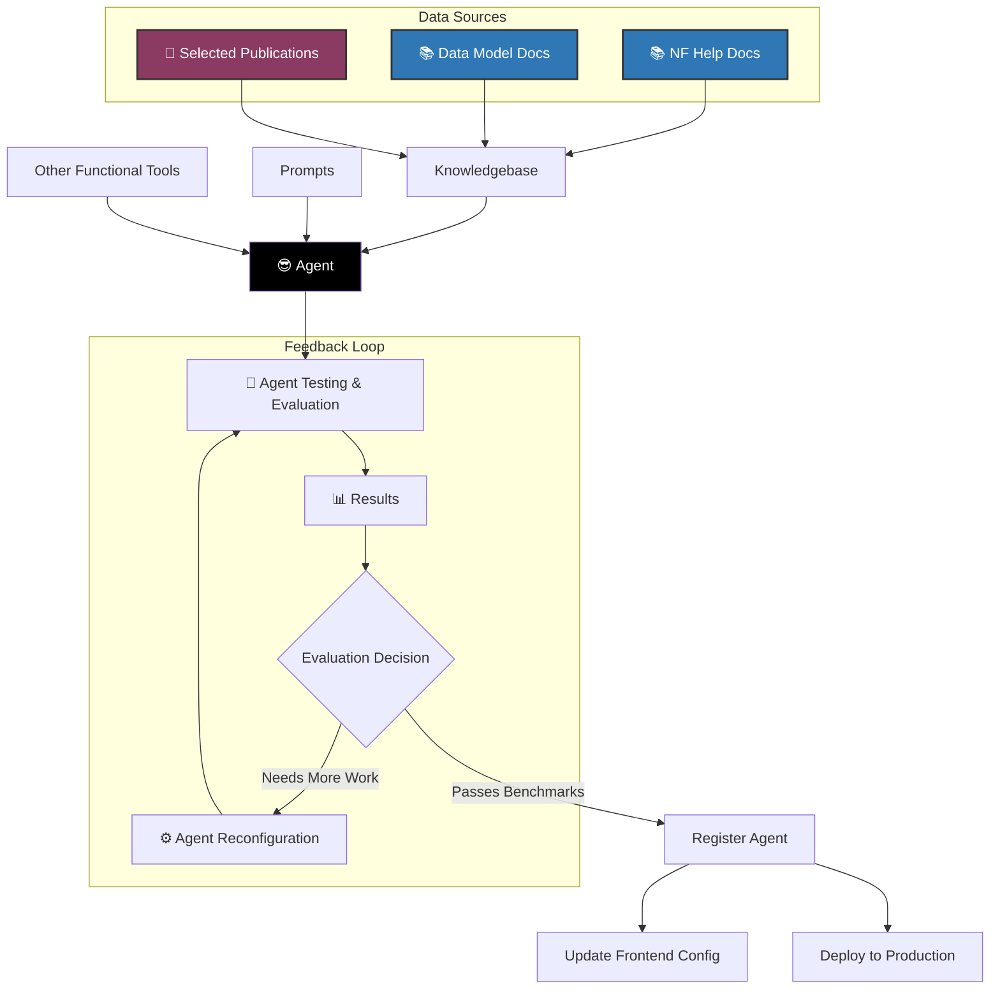

```mermaid
graph TD
    A[Knowledgebase] --> D[😎 Agent]
    P[Prompts] --> D
    L[Other Functional Tools] -->D
    
    D --> E[🧪 Agent Testing & Evaluation]
    E --> R[📊 Results]
    R --> G{Evaluation Decision}
    G --> |Needs More Work| F[⚙️ Agent Reconfiguration]
    F --> E
    G --> |Passes Benchmarks| H[Register Agent]
    
    subgraph "Feedback Loop"
        E
        R
        G
        F
    end
    
    subgraph "Data Sources"
        I[📚 NF Help Docs]
        J[📚 Data Model Docs]
        K[📑 Selected Publications]
    end
    
    I --> A
    J --> A
    K --> A
    
    H --> I1[Update Frontend Config]
    H --> I2[Deploy to Production]

    style I fill:#2F78B5,stroke:#333,stroke-width:2px
    style J fill:#2F78B5,stroke:#333,stroke-width:2px
    style K fill:#8B3A62,stroke:#333,stroke-width:2px

    classDef webcrawler color:white,fill:#2F78B5,stroke:#333,stroke-width:2px;
    classDef s3storage color:white,fill:#8B3A62,stroke:#333,stroke-width:2px;
    classDef agent color:white,fill:black

    class D agent;
    class I,J webcrawler;
    class K s3storage;
```
