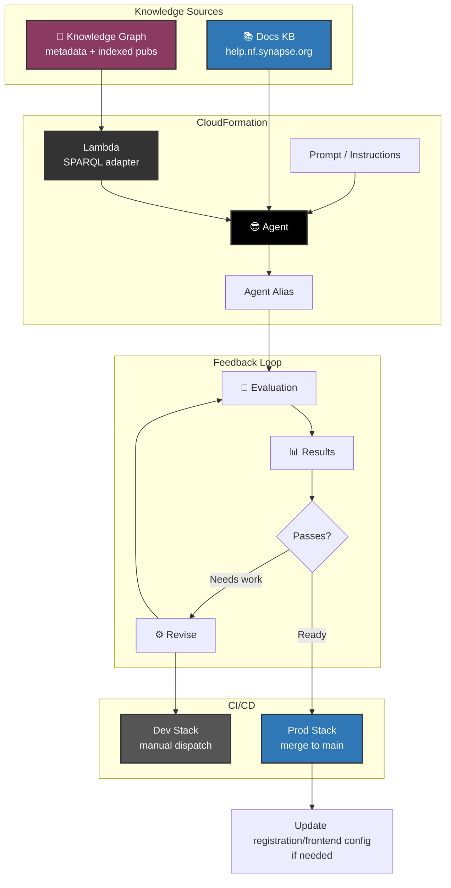

```mermaid
graph TD
    subgraph "Knowledge Sources"
        KB[📚 Docs KB<br/>help.nf.synapse.org]
        KG[🔗 Knowledge Graph<br/>metadata + indexed pubs<br/>]
    end

    subgraph "CloudFormation"
        Instructions[Prompt / Instructions]
        Lambda[Lambda<br/>SPARQL adapter]
        Instructions --> Agent[😎 Agent]
        Alias[Agent Alias]
    end

    KB --> Agent
    KG --> Lambda --> Agent
    Agent --> Alias

    subgraph "Feedback Loop"
        Eval[🧪 Evaluation]
        Results[📊 Results]
        Decision{Passes?}
        Reconfig[⚙️ Revise ]
    end

    Alias --> Eval
    Eval --> Results --> Decision
    Decision --> |Needs work| Reconfig --> Eval

    subgraph "CI/CD"
        Dev[Dev Stack<br/>manual dispatch]
        Prod[Prod Stack<br/>merge to main]
    end

    Reconfig --> Dev
    Decision --> |Ready| Prod
    Prod --> Register[Update registration/frontend config<br/>if needed]

    style KB fill:#2F78B5,stroke:#333,stroke-width:2px,color:white
    style KG fill:#8B3A62,stroke:#333,stroke-width:2px,color:white
    style Agent fill:black,stroke:#333,stroke-width:2px,color:white
    style Lambda fill:#333,stroke:#333,stroke-width:2px,color:white
    style Dev fill:#555,stroke:#333,stroke-width:2px,color:white
    style Prod fill:#2F78B5,stroke:#333,stroke-width:2px,color:white
```
